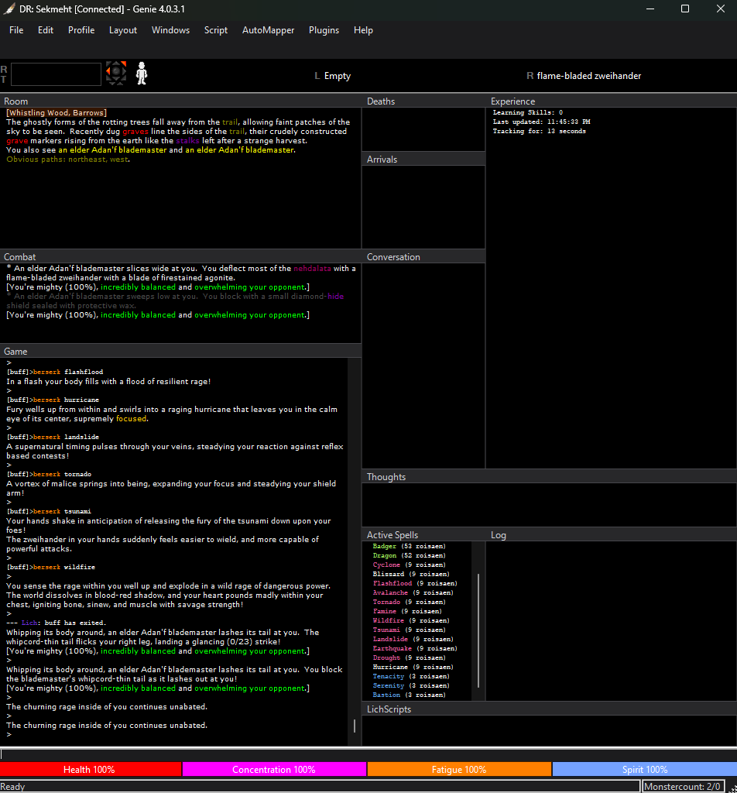
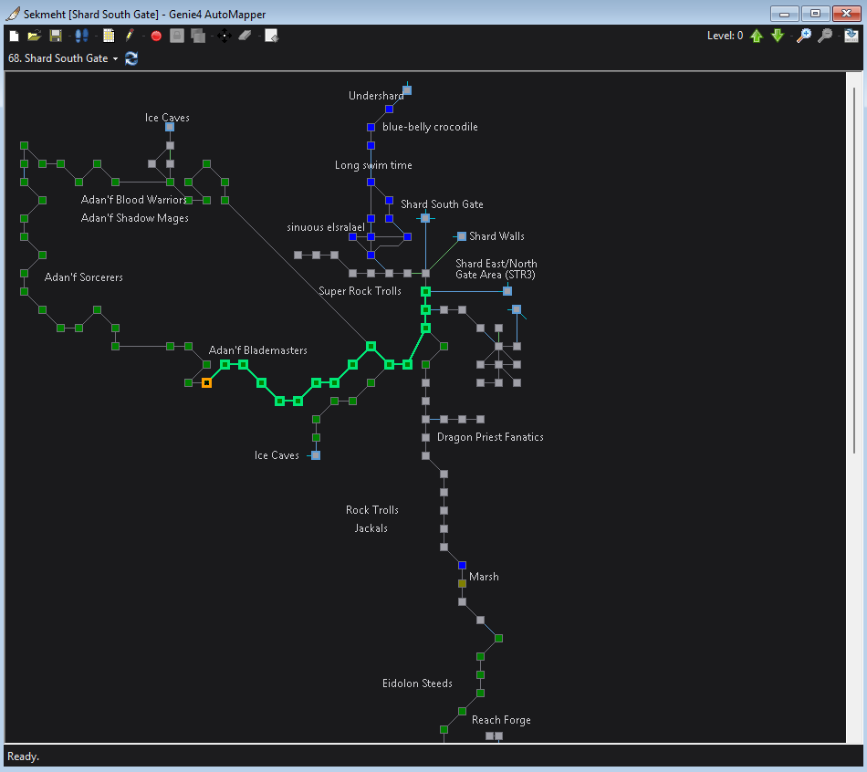

<h1 align="center">Genie4_Remix</h1>

  

    Modified version of the public release of <a href="https://github.com/GenieClient/">Genie4</a>. 
    This is currently an unofficial release — please do not expect the Genie team to support this version. <strong>USE AT YOUR OWN RISK!</strong>
  

  

    <code>Latest Version: 4.0.3.2</code> / <code>Release: 4/9/2026</code> / <code>Lich Support: Yes!</code> / <code>Stable? YES!</code>
  

  

    <kbd></kbd>
    <kbd></kbd>
  

<!-- ABOUT THE PROJECT -->
## About The Project

Genie4_Remix is an unofficial fork of [Genie4](https://github.com/GenieClient/Genie4), the community-developed front-end for Simutronics Corporation's game DragonRealms. This fork adds bug fixes, UI improvements, and quality-of-life features not yet merged upstream — including full dark/light/custom theming, a portable self-contained mode, AutoMapper enhancements, and numerous scripting engine fixes.

<!-- GETTING STARTED -->
## Getting Started

- Download the latest release at
   [https://github.com/SekmehtDR/Genie4_Remix/releases/latest](https://github.com/SekmehtDR/Genie4_Remix/releases/latest)

<!-- CHANGELOG -->
## Changelog

### v4.0.3.2
#### Update System
- **Auto-update disabled; update menu items hidden** (`Lists/Config.cs`, `Forms/FormMain.Designer.cs`) — `CheckForUpdates`, `AutoUpdate`, and `AutoUpdateLamp` config properties now always return `false` regardless of what is stored in `settings.cfg`. Users migrating from the upstream Genie4 repository with auto-update enabled in their config will no longer have their client rolled back on launch. The three update menu items (Check For Updates, Force Update, Load Test Client) and their separator have been removed from the Help menu; all backing code and click handlers remain intact for future use.

#### Lich Integration
- **Lich settings UI** (`Forms/FormConfig.cs`, `Forms/FormConfig.designer.cs`) — A new "Lich" tab in the Configuration window exposes all Lich-related settings with a proper UI. Fields for Ruby Path, Lich Path, Arguments, Server, Port, and Start Timeout each have labeled inputs. Path fields include Browse buttons with file-type filters. A "Test Paths" button validates that the Ruby and Lich files exist and displays pass/fail results inline so misconfigured paths are caught before attempting to connect. Settings are written back to `settings.cfg` when OK is clicked, eliminating the need to use `#config` commands for Lich setup.
- **Per-profile Lich preference** (`Forms/DialogProfileConnect.cs`, `Forms/DialogProfileConnect.Designer.cs`, `Forms/FormMain.cs`) — The profile connect dialog now has a "Connect via Lich" checkbox. When a profile is selected, the checkbox automatically reflects the saved Lich preference for that character. Checking or unchecking it before connecting overrides the preference for that session and saves the new value back to the profile XML (`UseLich` attribute on `<Profile>`). Profiles without the attribute default to unchecked. This eliminates the need to remember or type `#lc <profile>` — selecting the character and clicking Connect is all that's required when the preference is saved.
- **Lich mode no longer persists after disconnect** (`Core/Game.cs`) — The `IsLich` flag was set to `true` when connecting via `#lc` but never reset on disconnect. On the next connection attempt — even through the normal profile dialog — Genie would silently try to route through Lich (localhost:11024), causing a failed or hung connection if Lich was no longer running. Fixed by resetting `IsLich = false` inside the `ConnectedGame` disconnect guard in `GameSocket_EventDisconnected`, so the reset only fires when a real game session ends and not during the mid-connection handshake when Genie switches from the eaccess auth server to the game server.
- **Lich mode now respected when entering credentials manually** (`Forms/FormMain.cs`) — When a profile had no saved password, the user was prompted to enter credentials via `DialogConnect`. That code path called `ConnectToGame` without passing the `isLich` flag, so it defaulted to `false` regardless of whether the session was initiated via `#lc`. Players without saved passwords could never reliably connect through Lich from the UI. Fixed by passing `m_oGame.IsLich` through to the `ConnectToGame` call in the manual credential path.

#### Performance
- **`SetBufferEnd` no longer blocks the socket receive thread** (`Script/Script.cs`) — `SetBufferEnd()` was acquiring each script's `m_oThreadLock` with a 3,500ms timeout before setting the buffer-end flag. This method is called from `Simutronics_EventEndUpdate`, which runs on the socket receive thread — the same thread responsible for calling `BeginReceive` to read the next chunk of data from the server. While the receive thread was blocked waiting to acquire script locks (which are held during normal script execution), no new data could be read from the server. With multiple scripts running, the stall compounded: N active scripts × up to 3,500ms each = up to 10–15 seconds of receive thread starvation per incoming game line, presenting as severe response lag even though commands were being sent instantly. Fixed by changing `m_bBufferEnd` to `volatile` and rewriting `SetBufferEnd()` to assign the flag directly with no lock acquisition. `volatile` provides the necessary cross-thread memory visibility guarantee without any blocking.
- **Trigger processing decoupled from network thread** (`Forms/FormMain.cs`) — Highlights, gags, and substitutes were already running on the socket thread; trigger and script `waitfor`/`matchwait` evaluation was the remaining synchronous work blocking it. Each incoming line now enqueues its text into a `Channel<string>` (non-blocking, microseconds) and the socket moves on immediately. A dedicated background consumer drains the channel and calls `ParseTriggers` sequentially, preserving strict FIFO ordering so triggers fire in the same order lines arrive. Script `waitfor` and `matchwait` matching are unaffected — they still resolve correctly because the consumer is single-reader and processes lines one at a time. The channel is completed cleanly on form close so no trigger work is dropped.
- **Highlight case-insensitive flag now respected** (`Lists/Highlights.cs`, `Core/Game.cs`, `Forms/Components/ComponentRichTextBox.cs`) — The combined highlight regex (both string and line variants) was compiled as a single alternation with no flags, meaning the `CaseSensitive = false` setting on individual highlights was silently ignored. Fixed by splitting each rebuild into two regexes: one for case-sensitive highlights (no flags, existing behavior) and one for case-insensitive highlights (`RegexOptions.IgnoreCase`). Both `PrintTextWithParse` in `Game.cs` and `ParseHighlights` in `ComponentRichTextBox` now run a second pass against the CI regex. A `GetCaseInsensitive()` helper on `Highlights` resolves the matched text back to the stored highlight using `OrdinalIgnoreCase`, since the game-text case at match time may differ from the stored key.

#### Bug Fixes
- **Concurrent socket writes to Lich now serialized** (`Core/Connection.cs`) — The trigger processing channel introduced in this release moved trigger actions onto a background thread. This created a race condition where a trigger-fired command and a user-typed command could both call `BeginSend` on the socket simultaneously from different threads, potentially interleaving bytes and sending malformed data to Lich. Added a `m_oSendLock` around all `BeginSend` calls so sends are always serialized regardless of which thread initiates them.
- **Script TriggerParse no longer blocks on busy scripts** (`Script/Script.cs`, `Lists/Config.cs`) — `TriggerParse` was waiting up to 3,500ms to acquire each script's thread lock. With multiple running scripts and the new background trigger consumer holding the `m_oScriptList` reader lock for the full duration, operations like `AbortScript` from the UI thread could be blocked for seconds (N scripts × 3,500ms). Changed the lock timeout to 100ms — long enough to cover normal instruction execution (typically microseconds) so `waitfor`/`matchwait` matches are not missed, but short enough that worst-case pipeline stall with several scripts is under 300ms instead of 10+ seconds. `AbortScript` retains the full 3,500ms timeout since killing a script must always succeed. The timeout is user-configurable via `#config {scriptmatchtimeout} {100}` in `settings.cfg`.

#### Enhancements
- **Castbar shows "Ready" when spell is prepared and cast RT expires** (`Forms/Components/ComponentRoundtime.cs`, `Forms/FormMain.cs`) — Previously the castbar (spell RT bar) would go dark and empty once the cast roundtime counted to zero, giving no visual indication that the spell was still prepared and ready to cast. The bar now displays "Ready" when the countdown expires while a spell is prepared. The text and bar clear automatically when the spell is cast, dismissed, or lost (e.g. "Your concentration slips...").

#### Code Cleanup
- **Dead substitution block removed** (`Core/Game.cs`) — A 37-line substitution loop inside `PrintTextToWindow` was permanently disabled behind `if (0 == 1)` with a comment noting it should be replaced by `ParseSubstitutions`. That consolidation was done; the dead block is now removed.

### v4.0.3.1
#### Bug Fixes
- **Script bar, input box, and input panel no longer flash light on startup** (`Forms/FormMain.Designer.cs`, `Forms/FormMain.cs`) — Three components had incorrect designer defaults that caused a visible flash of unstyled controls before `RecolorUI()` applied the dark theme. The script bar (`_ToolStripButtons`) used `SystemColors.Control` (Windows light gray) and `RenderMode.System`, making it render as a classic Windows toolbar until the theme was applied. The input textbox (`_TextBoxInput`) defaulted to `Color.White`, appearing as a jarring bright box against the dark form background. The input panel (`_PanelInput`) used `Color.Transparent`, leaving the textbox visually unanchored with no consistent frame. Fixed by setting all three to their correct dark defaults in the designer: script bar to `Color.FromArgb(30, 30, 32)` with `ManagerRenderMode`; textbox to `Color.FromArgb(28, 28, 30)`; input panel to `Color.FromArgb(30, 30, 32)`. Input panel padding was also balanced (`4, 3, 4, 2`) and height bumped from 23px to 27px for a proper visual frame around the textbox. `RecolorUI()` now also updates `_PanelInput.BackColor` so the frame stays correct when switching between Dark, Light, and Custom themes.
- **GDI resource leaks fixed in RT and health/mana bar components** (`Forms/Components/ComponentRoundtime.cs`, `Forms/Components/ComponentBars.cs`) — `ComponentRoundtime` was leaking a `SolidBrush` on every paint tick (every second during active roundtime) because the brush was created without a `using` statement. Additionally, both `ComponentRoundtime` and `ComponentBars` were creating new `Pen` objects in their `BorderColor` property setters without disposing the previous ones, accumulating leaked GDI handles over the session. `ComponentRoundtime` also initialized its four border pen fields from `Pens.Gray` (a shared system pen that must never be disposed), making safe cleanup impossible. Fixed by: changing all four field initializers to `new Pen(Color.Gray)` so the component owns them from the start; adding `Dispose()` calls on the old pen before replacement in both setters; adding `using var` to the `SolidBrush` in `PanelRT_Paint`; and subscribing to the `Disposed` event in both constructors to clean up the final pen instances when the components are destroyed.
- **Menu separators now visible in all menus** (`Forms/FormMain.cs`) — The `RecolorUI()` loop that applies theme colors to menu items was also running on `ToolStripSeparator` entries. Because separators have no `Text`, the `IsNullOrWhiteSpace` check flagged them, setting `AutoSize = false` and halving their height (`item.Height / 2`). Separators added statically in the designer were being crushed to zero or near-zero height and rendered invisible; only separators added dynamically after `RecolorUI()` ran (such as the one above Color Themes in the Layout menu) remained visible. Fixed by skipping separators in the loop — `MenuRenderer.OnRenderSeparator` already handles their rendering correctly at the natural 6px height.
- **Merged upstream/Dev-4-0-2-10** — <a href="https://github.com/GenieClient/Genie4/commits/Dev-4-0-2-10/"> Merged upstream/Dev-4-0-2-10</a> branch.
- **Automapper Maps Load without Lich** — Pull request code "Add support for ShowRoomID flag" was added - <a href="https://github.com/GenieClient/Genie4/pull/175"> Genie4/pull/175</a>.
- **Fix sounds not playing for regex highlights** — Pull request code "Add support for ShowRoomIFix sounds not playing for regex highlights" was added - <a href="github.com/GenieClient/Genie4/pull/177"> Genie4/pull/177</a>.
- **Running script context menu restored** — The dropdown arrow and context menu (Resume, Pause, Abort, Debug, Show Trace, Show Vars, Edit) on running script toolbar buttons were no longer visible after the custom `MenuRenderer` was introduced. The base `ToolStripRenderer` does not paint split button backgrounds, so the dropdown zone was invisible. Added `OnRenderSplitButtonBackground` to explicitly render the button area, a theme-adaptive tinted dropdown zone, a divider line, and a filled down-arrow glyph. Works correctly across Dark, Light, and Custom themes.
- **ProfileConnect "Edit Note" crash fixed** (`Forms/DialogProfileConnect.cs`, fixes <a href="https://github.com/GenieClient/Genie4/issues/178">Genie4/issues/178</a>) — `EditNote_Click` threw a `NullReferenceException` when the profile list was in flat (non-tree) view mode because `_profiles.SelectedNode` was null. Added an early-return guard. Also corrected the dialog owner: `ShowDialog(Parent)` was passing the MDI client as owner, which caused `DialogProfileNote` to be positioned relative to the main window and appear behind it. Changed to `ShowDialog(this)` so the note dialog centers on the profile connect dialog as intended.
- **`$unixtime` now works inside `waiteval`** (`Core/Game.cs`, fixes <a href="https://github.com/GenieClient/Genie4/issues/179">Genie4/issues/179</a>) — `$unixtime` was a lazy placeholder (`@unixtime@`) substituted only at parse time and never fired a variable-changed event, so `waiteval` conditions containing it would stall forever. Fixed by updating the `unixtime` variable list entry with the current Unix timestamp and firing `VariableChanged("$unixtime")` each time the server sends a time tick — the same mechanism that makes `$gametime` work in `waiteval`.
- **`#mapper allowdupes true/false` now sets state correctly** (`Mapper/MapForm.cs`, fixes <a href="https://github.com/GenieClient/Genie4/issues/169">Genie4/issues/169</a>, <a href="https://github.com/GenieClient/Genie4/issues/154">Genie4/issues/154</a>) — `SetAllowDuplicatesToggle(bool)` ignored its parameter and always toggled the current state, making `#mapper allowdupes true` and `#mapper allowdupes false` behave identically. Fixed to assign the parameter directly so the command reliably sets the desired state regardless of what it was before.
- **Script `contains()` with multi-condition evaluation fixed** (`Script/Eval.cs`, fixes <a href="https://github.com/GenieClient/Genie4/issues/145">Genie4/issues/145</a>) — `if (contains("x", "%1") && "%2" == "")` and similar compound expressions evaluated incorrectly. In `ParseSection`'s comparison pass, `iArgLeft` was not reset when a `&&` or `||` operator was encountered, causing the left operand of one sub-expression to "bleed" into the right side of an unrelated comparison across the logical operator boundary. `&&` and `||` now act as group boundaries in the comparison pass, resetting `iArgLeft` so each sub-expression is evaluated independently before being combined.
- **Map files saved as UTF-8 instead of UTF-16** (`Mapper/MapForm.cs`, fixes <a href="https://github.com/GenieClient/Genie4/issues/166">Genie4/issues/166</a>) — `XmlTextWriter` was constructed with `System.Text.Encoding.Unicode` (UTF-16 LE), producing map XML files with a UTF-16 BOM and two-byte-per-character encoding. External tools, Lich, and cross-platform scripts expect standard UTF-8 XML. Changed to `System.Text.Encoding.UTF8` so saved map files are universally compatible.
- **Script and debug output now captured by Auto Log** (`Forms/FormMain.cs`, fixes <a href="https://github.com/GenieClient/Genie4/issues/80">Genie4/issues/80</a>, <a href="https://github.com/GenieClient/Genie4/issues/54">Genie4/issues/54</a>) — When Auto Log is enabled, script output (status messages like `[Script loaded:]`, `[Script aborted:]`) and debug lines (e.g. `wait.cmd(2): [start:]`) were silently dropped by the logger because `Script_EventPrintText` only sent text to the game window, never to the log. Added a `LogText` call in `Script_EventPrintText` so all script output — including debug at any level — is captured in the existing `CharacterNameGame_YYYY-MM-DD.log` file alongside game text, with no new config options or separate files needed. Also fixed `[Script debuglevel set to N]` messages (generated directly in FormMain when changing debug level from the running script context menu) which bypassed `Script_EventPrintText` entirely and were also missing from the log. Additionally fixed a formatting issue where script lines were being appended directly after the game prompt (`> [Script loaded:]`) — script text now checks `LastRowWasPrompt` and inserts a newline when needed so each script line starts cleanly on its own line in the log.
- **Highlights Enabled / Substitutes Enabled toggles added to File menu; "Ignores/Gags" renamed to "Gags"** (`Lists/Config.cs`, `Core/Game.cs`, `Forms/Components/ComponentRichTextBox.cs`, `Forms/FormMain.cs`, `Forms/FormMain.Designer.cs`, fixes <a href="https://github.com/GenieClient/Genie4/issues/125">Genie4/issues/125</a>) — Added `bHighlightsEnabled` and `bSubstitutesEnabled` flags to `Config`. File menu now has **Highlights Enabled** and **Substitutes Enabled** checkboxes below Gags Enabled and above Triggers Enabled. When Highlights Enabled is unchecked, all highlight processing (line-color matching in `PrintTextWithParse` and full `ParseHighlights` pass in `ComponentRichTextBox`) is bypassed. When Substitutes Enabled is unchecked, `ParseSubstitutions` is skipped for all game text including bold/creature buffers. "Ignores/Gags Enabled" renamed to "Gags Enabled" to match the tab label.
- **External editor and file browser launches no longer block the UI** (`Core/Command.cs`, `Forms/FormMain.cs`, `Forms/ScriptExplorer.cs`) — Replaced all `Interaction.Shell()` calls (25 locations) with `Process.Start()` across script editing, config file editing (`#edit` commands for aliases, triggers, highlights, gags, macros, substitutes, presets, names, variables, settings), log file opening, and all Open Directory menu items. `Interaction.Shell()` is a VB6-era method that transfers focus synchronously and can cause brief UI freezes. `Process.Start()` launches the external process non-blocking with no focus interference.
- **Reduce UI stutter when connecting** (`Core/Game.cs`, credit: <a href="https://github.com/digitalnyc1">digitalnyc1</a> via <a href="https://github.com/digitalnyc1/Genie4x/commit/5c069d6">Genie4x/5c069d6</a>) — Three synchronous socket calls (`Connect` and `ConnectAndAuthenticate`) were blocking the main thread during connection, causing the UI to freeze and stutter. Wrapped all three in `Task.Run()` so they execute on a background thread, keeping the UI responsive while connecting.
- **Linebreak added after pasted images** (`Forms/Components/ComponentRichTextBox.cs`, credit: <a href="https://github.com/digitalnyc1">digitalnyc1</a> via <a href="https://github.com/digitalnyc1/Genie4x/commit/5a6af34">Genie4x/5a6af34</a>) — After pasting an image into the RichTextBox, no newline was inserted so subsequent text would appear on the same line as the image. Added `Select(TextLength, 0)` and `SelectedText = Environment.NewLine` after the paste so images are always followed by a clean line break.
- **Timestamps no longer break regex anchors** (`Forms/Components/ComponentRichTextBox.cs`, fixes <a href="https://github.com/GenieClient/Genie4/issues/168">Genie4/issues/168</a>) — When timestamps were enabled, the `[HH:MM AM/PM] ` prefix prepended to each line caused `^`-anchored regex highlight patterns (e.g. `^You`) to never match because the line started with `[` rather than the game text. Fixed by building a timestamp-stripped copy of the buffer text and a position map before regex matching. The regex runs against the stripped text so anchors work as expected, and match indices are translated back to their original positions in the buffer for correct highlight coloring.
- **Config panel icons restored** (`Forms/ConfigPanels/*.Designer.cs`) — During the VB.NET→C# conversion, all 10 configuration panel designers (`UCHighlightStrings`, `UCWindows`, `UCAliases`, `UCMacros`, `UCTriggers`, `UCSubs`, `UCIgnore`, `UCNames`, `UCPreset`, `UCClasses`) were left loading their toolbar and button icons via `resources.GetObject(...)` from per-form `.resx` files that were never populated with image data. This caused every icon — Refresh, Add, Remove, Load, Save, Play (sound preview), foreground color (pencil), background color (paint), font, and edit — to silently return null and render as blank buttons. Fixed by replacing all `resources.GetObject(...)` image assignments with direct references to `My.Resources.Resources.*`, matching the pattern already used correctly in `UCWindowSettings`. The now-unused `ComponentResourceManager resources` variable was also removed from each file. The Play button additionally required pointing at `control_play` (already registered in `Resources.resx`) rather than the unregistered `play` entry.
- **Mana/Inner Fire bar decoupled from Magic Panels toggle; guild-aware bar layout** (`Forms/FormMain.cs`, `Forms/FormMain.Designer.cs`) — The Mana bar (displayed as "Inner Fire" for Barbarians) was previously hidden whenever the Magic Panels layout option was turned off, because `SetMagicPanels()` blindly hid all magic-related UI including `ComponentBarsMana`. Fixed by separating bar visibility from panel visibility: the castbar and spell labels still respond to the Magic Panels toggle, but `ComponentBarsMana` is now controlled independently via `UpdateManaBarVisibility()`. Additionally, guilds that have no use for a mana bar (Thief, Commoner) automatically hide the bar and physically shift the remaining bars left (Concentration→1, Fatigue→2, Spirit→3) before collapsing `TableLayoutPanelBars` to 4 columns, ensuring Spirit is never clipped. All other guilds restore the full 5-bar layout (Mana/Inner Fire→1, Concentration→2, Fatigue→3, Spirit→4). Visibility and column positions update whenever the server sends the `$guild` variable, so layout reacts correctly on login and character switches.

#### Portable / Self-Contained Mode
- **Fully portable** — Genie now always stores all user data (Config, Scripts, Maps, Logs, Sounds, Plugins, Icons, Help) in the application's own directory instead of `%appdata%`. The entire client can be copied to any folder, moved to a thumb drive, or run from a network share with no reconfiguration.
- **Auto-bootstrap on first run** — If the local `Config` folder does not exist when Genie starts, all required directories are created automatically next to the exe. No installer step required.
- **Migration path** — Existing users can copy the contents of `%appdata%\Genie4\` into the Genie application folder once to carry over all settings, highlights, aliases, maps, and scripts.

### v4.0.3.0
#### UI & Theme
- **Dark/Light/Custom theme system** — OS-level dark mode via `uxtheme.dll` and `dwmapi.dll` APIs. Menus, scrollbars, title bars, dropdowns, and all native controls respond to the active theme. Toggle via **Layout → Color Themes** with checkmarks indicating the active selection.
- **Flat dark title bars** — Replaced bitmap-tiled window skins with a flat charcoal title bar (`#28282A`) and 1px accent line on all MDI child windows. Cleaner appearance with improved paint performance.
- **Dark scrollbars** — Applied `SetWindowTheme("DarkMode_Explorer")` to all rich text output windows.
- **Menu renderer** — Full custom `ToolStripRenderer` for menus and context menus. Flat, no gradients, theme-aware hover and checked states.
- **MDI background** — Updated to near-black (`#141416`) in dark mode.
- **Status strip** — Flat style, grip hidden, themed to match active color mode.
- **Plugins menu** — Removed stray blank separator that appeared when no plugins were loaded.
- **AutoMapper theme integration** — The AutoMapper window now fully responds to Dark/Light/Custom theme switches. The map panel background, toolbar, status bar, node colors, exit lines, path highlight, and current position indicator all update when the theme changes. Custom mode restores whatever colors were set in `presets.cfg` at startup.

#### Bug Fixes
- **Window snap logic** — Corrected bitwise `&` operators to logical `&&` in FormSkin drag/snap conditions. Previously the snap guard (`bSnappedX/Y == false`) was not short-circuiting correctly, allowing double-snap in edge cases.
- **AutoMapper GDI leaks** — All `Pen`, `SolidBrush`, and `Font` objects created in the map paint loop are now properly disposed via `using`. On large maps this eliminates hundreds of leaked GDI handles per second that could cause rendering corruption or exhaustion on long sessions.
- **ComponentBars pen leak** — Border pens are now disposed before replacement when `BorderColor` is set, preventing accumulation of leaked GDI objects over the session.
- **ComponentRoundtime pen leak** — All four border pens (`m_BorderColor`, `m_BorderColorGrayScale`, `m_BorderColorRT`, `m_BorderColorRTGrayScale`) are now disposed on component teardown and before replacement in setters.
- **MenuRenderer check font** — `Font` and `StringFormat` for the checkmark glyph promoted to `static readonly` fields; previously recreated on every checked-item paint call.
- **Status strip flat borders removed** — All 10 `ToolStripStatusLabel` controls had `BorderSides = All` + `Border3DStyle.Flat` which rendered as dated raised/etched borders in the status bar. Both properties removed; labels now sit flush against the status strip background for a clean modern look.
- **Label fonts modernized** — `_LabelSpell`, `_LabelRH`, `_LabelLH`, `_LabelRT` (hand/spell/RT indicator labels) changed from `Microsoft Sans Serif 8.25pt Bold` + `Color.DimGray` to `Segoe UI 8.25pt Bold` + `Color.FromArgb(140,140,145)`. Roundtime countdown label changed from `Arial 14.25pt` to `Segoe UI 11pt` for consistent typography across the status panel.
- **FormSkin title font disposal** — `oTitleFont` (used to draw MDI child title bar text) is now disposed in `FormSkin.Dispose()`, preventing a Font GDI handle leak each time a skin window is closed.
- **SetStyle moved to constructor** — `ControlStyles` flags (`DoubleBuffer`, `AllPaintingInWmPaint`, `UserPaint`, `Opaque`) were being set inside the `Paint` event handler behind a one-time flag. Moved to both `FormSkin` constructors where they belong; removed the `bIsBitsSet` guard field.
- **`ImageToGrayScale` ColorMatrix rewrite** — Replaced the per-pixel `GetPixel`/`SetPixel` loop in `ComponentIconBar` with a single `ColorMatrix` + `Graphics.DrawImage` pass via `ImageAttributes`. Eliminates O(w×h) managed P/Invoke calls on every icon load; standard luminance weights (0.299R, 0.587G, 0.114B) are preserved and alpha channel is passed through unchanged.
- **`MakeTransparent` moved to load time** — `Bitmap.MakeTransparent(Color.Black)` was being called inside `AppendImage`, which fires on every compass `Paint` event. Moved to `AddImage` so it runs once per icon at startup. Also fixed `AddImage` loading each icon file twice from disk (two `Image.FromFile` calls for the same path); now loaded once with `using var src`. Compass paint calls now dispose the cloned bitmap returned by `ImageListIcons.Images[key]`.

#### Performance
- **Regex compilation** — Frequently-used highlight and name patterns now use `RegexOptions.Compiled`.
- **StringBuilder** — Replaced `string +=` concatenation in `RebuildStringIndex`, `RebuildLineIndex`, and `RebuildIndex` to eliminate O(n²) allocations.
- **Highlight parsing** — Buffer text and line split are now cached once per parse pass instead of re-computed per highlight entry.
- **Substitution scanning** — Removed redundant `.Match()` before `.Replace()`; uses `ReferenceEquals` to detect no-match.
- **AutoMapper regex cache** — `IsExitSet()` now caches compiled exit regexes in a `Dictionary<string, Regex>` instead of recompiling on every call.
- **Non-blocking UI text dispatch** — Switched `AddText` from synchronous `Control.Invoke` to `Control.BeginInvoke`. The network thread no longer blocks waiting for each line to render before parsing the next, eliminating the stutter and jerkiness visible during bursts of incoming game text (movement, combat, room descriptions).

#### AutoMapper
- **Description matching robustness** — Room descriptions are now normalized before comparison (whitespace collapsed, case-insensitive). Minor game text updates no longer cause the mapper to lose position or create duplicate rooms.
- **Movement queue timeout visibility** — When the movement queue is cleared due to timeout, a message is always shown in the game window so players know the mapper may need a resync. Previously this was silent unless debug mode was enabled.
- **File handle leak fixed** — `StreamReader` instances in `RoomOnDisk` and `EchoRoomsOnDisk` are now properly disposed after use, preventing file handle exhaustion when scanning large map directories.
- **`#mapper save` path bug fixed** — Saving a map by filename (e.g. `#mapper save mymap`) now correctly constructs the path. A typo (`==` instead of `\`) was silently producing invalid file paths and losing saves.
- **Thread safety** — Map UI updates (`UpdateGraph`, `UpdateMap`, `SetNodeList`, `SetDestinationNode`) now marshal to the UI thread via `BeginInvoke`. Previously these were called directly from the game network thread, racing with the paint event and causing phantom position jumps, rendering glitches, and occasional crashes.
- **`UpdateCurrentRoom` refactor** — The 640-line monolithic room-tracking method was split into 13 focused helper methods (`BuildCurrentNode`, `DequeueMove`, `LocateViaLinkedArc`, `LocateViaBlankMove`, `LocateViaUnlinkedDirection`, etc.). No logic changes — purely structural, making future bug fixes and improvements tractable.
- **Fuzzy description matching** — When normalized exact match fails, a secondary fuzzy pass strips volatile segments (NPC presence lines, "also here:", "obvious exits:", article/number prefixes) before comparing. Catches cases where Simutronics adds or removes dynamic text without changing the room itself.
- **Map directory index cache** — `#mapper find` and auto-load no longer open every `.xml` file on disk on each invocation. A lightweight in-memory index is built once on first use and invalidated when a map is loaded, making room searches near-instant on large map collections.
- **AutoMapper toolbar themed** — The mapper's toolbar and status bar now use the same flat `MenuRenderer` as the rest of Genie. Background, foreground, hover, and separator colors all match the active theme.
- **Path visualization** — When a route is active, path nodes are highlighted with a thick colored border (preserving the node's original fill color, so cyan homes and other custom colors remain visible). The connecting exit lines along the route are also drawn in the path color at increased width, making the full route easy to follow at a glance.
- **Current position indicator** — The "you are here" node is rendered with a thick colored border and an X glyph drawn in a darkened variant of the `automapper.here` color, giving strong contrast against the node fill at any zoom level. Color is amber in Dark mode, deep red in Light mode, and fully customizable via `presets.cfg`.
- **`automapper.here` preset** — New preset key controls the current-room indicator color independently of the path color. Defaults to `Maroon` so it works in Custom/default themes without any config change.
- **MDI control-box icons** — Minimize/restore/close icons injected into the MenuStrip when an MDI child is maximized are now inverted in dark mode so they appear white instead of black.

#### Status Bar
- **Spell prep bar layout fixed** — The castbar (`ComponentRoundtime`, magenta) was free-floating at a hardcoded pixel position (`x=1172`) outside the status bar's table layout, causing it to appear far to the right at all window sizes. It is now a proper column in `TableLayoutPanelFlow`, stretching correctly at any resolution.
- **Magic panels toggle fixed** — Toggling magic panels off now correctly collapses the table to 5 columns (removing spell name and castbar). The column count was off by one after the castbar was moved into the table.
- **Status bar MaximumSize removed** — `TableLayoutPanelFlow` had a hardcoded `MaximumSize` of 1167px, preventing it from filling the full window width. Removed so the bar stretches edge to edge.

#### Startup
- **No startup flicker** — Main window is hidden (`Opacity = 0`) from construction until presets are loaded and the theme is fully applied, then appears in one clean frame. Eliminates the brief flash of unstyled or partially-painted windows on launch.
- **Deferred paint pump** — Removed the premature `Application.DoEvents()` call that was forcing a repaint of MDI child windows before their content had finished drawing.

#### Shutdown & Connectivity
- **Clean exit via X button** — Clicking X while connected now prompts the user and, on confirmation, sends `quit` through the active connection (including Lich proxy) before closing. This gives Lich and all scripts the same clean shutdown signal as typing `quit` in game.
- **Plugin shutdown ordering** — Plugins receive `ParentClosing()` only when the user confirms close, not on every X click. Prevents plugins (e.g. SpellTimer) from saving/exiting prematurely when the user cancels.
- **Connection lost handling** — Added `EventGameDisconnected` on `Game` fired from both clean disconnect and connection-lost paths, ensuring Genie exits correctly even when Lich closes the socket before the `<exit/>` tag is parsed.
