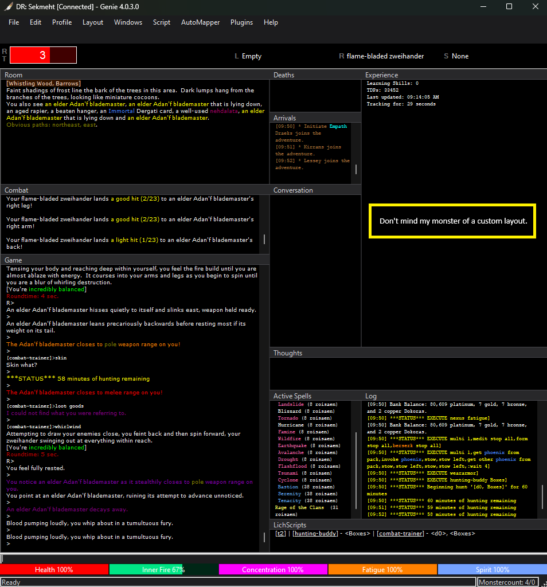

# Genie4_Remix

Modified version of the public release of Genie4 (https://github.com/GenieClient/). 
This was meant to be a personal tribute edition for Djordje, the eventual goal will be to merge this into Genie's public release of the client, but for now i'm sharing it here.

Latest Version: 4.0.3.0
Release: 3/29/2026
Lich Support: Yes!

<kbd></kbd>

- Download the latest ZIP file.
- Extract this folder somewhere on your PC, open the folder and double-click Genie.exe.
- In this version of Genie, click File > Open Directory
- Copy over your Config, Maps, Plugins and Scripts folder from your working version of Genie.
- Close and relaunch this new version of Genie.

Additionally:
- Ignore any prompts stating there's an update. This is prompting you to update BACK to the public released version of Genie.
- If you find yourself updating maps frequently, don't forget to copy over your lamp.exe to your new Genie folder!
- I didn't want to modify these parts of the game client too heavily since they are needed when or if it merges. 

<!-- CHANGELOG -->
## Changelog

### v4.0.3.0
#### UI & Theme
- **Dark/Light/Custom theme system** — OS-level dark mode via `uxtheme.dll` and `dwmapi.dll` APIs. Menus, scrollbars, title bars, dropdowns, and all native controls respond to the active theme. Toggle via **Layout → Color Themes** with checkmarks indicating the active selection.
- **Flat dark title bars** — Replaced bitmap-tiled window skins with a flat charcoal title bar (`#28282A`) and 1px accent line on all MDI child windows. Cleaner appearance with improved paint performance.
- **Dark scrollbars** — Applied `SetWindowTheme("DarkMode_Explorer")` to all rich text output windows.
- **Menu renderer** — Full custom `ToolStripRenderer` for menus and context menus. Flat, no gradients, theme-aware hover and checked states.
- **MDI background** — Updated to near-black (`#141416`) in dark mode.
- **Status strip** — Flat style, grip hidden, themed to match active color mode.
- **Plugins menu** — Removed stray blank separator that appeared when no plugins were loaded.

#### Performance
- **Regex compilation** — Frequently-used highlight and name patterns now use `RegexOptions.Compiled`.
- **StringBuilder** — Replaced `string +=` concatenation in `RebuildStringIndex`, `RebuildLineIndex`, and `RebuildIndex` to eliminate O(n²) allocations.
- **Highlight parsing** — Buffer text and line split are now cached once per parse pass instead of re-computed per highlight entry.
- **Substitution scanning** — Removed redundant `.Match()` before `.Replace()`; uses `ReferenceEquals` to detect no-match.
- **AutoMapper regex cache** — `IsExitSet()` now caches compiled exit regexes in a `Dictionary<string, Regex>` instead of recompiling on every call.
- **Non-blocking UI text dispatch** — Switched `AddText` from synchronous `Control.Invoke` to `Control.BeginInvoke`. The network thread no longer blocks waiting for each line to render before parsing the next, eliminating the stutter and jerkiness visible during bursts of incoming game text (movement, combat, room descriptions).

#### Shutdown & Connectivity
- **Clean exit via X button** — Clicking X while connected now prompts the user and, on confirmation, sends `quit` through the active connection (including Lich proxy) before closing. This gives Lich and all scripts the same clean shutdown signal as typing `quit` in game.
- **Plugin shutdown ordering** — Plugins receive `ParentClosing()` only when the user confirms close, not on every X click. Prevents plugins (e.g. SpellTimer) from saving/exiting prematurely when the user cancels.
- **Connection lost handling** — Added `EventGameDisconnected` on `Game` fired from both clean disconnect and connection-lost paths, ensuring Genie exits correctly even when Lich closes the socket before the `<exit/>` tag is parsed.
