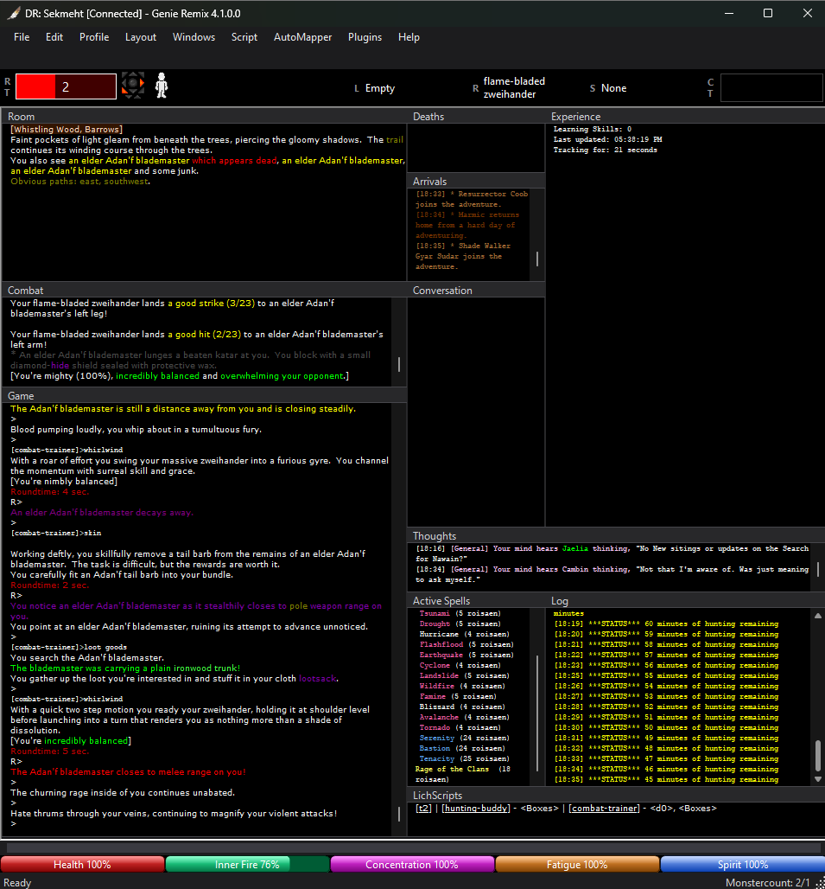

<h1 align="center">Genie Remix</h1>

  An unofficial, modernized fork of <a href="https://github.com/GenieClient/Genie4">Genie4</a> for DragonRealms. 
  Not supported by the Genie team. <strong>USE AT YOUR OWN RISK.</strong>

  <code>Version: 4.1.0.0</code> &nbsp;|&nbsp; <code>Released: 4/16/2026</code> &nbsp;|&nbsp; <code>Platform: .NET 10</code> &nbsp;|&nbsp; <code>Lich: Yes</code> &nbsp;|&nbsp; <code>Stable: Yes</code>

  <kbd></kbd>
  <kbd></kbd>

---

## About

Genie Remix is a drop-in replacement for [Genie4](https://github.com/GenieClient/Genie4). If you are already using Genie4, your existing settings, scripts, maps, and highlights carry over with no changes needed.

The goal is a client that works better and gets out of your way — fixing long-standing bugs, improving Lich reliability, modernizing the UI, and upgrading the underlying runtime to .NET 10.

---

## Getting Started

Download the latest release:
[https://github.com/SekmehtDR/Genie4_Remix/releases/latest](https://github.com/SekmehtDR/Genie4_Remix/releases/latest)

---

## Features

### Themes & Visual Polish
- Full dark, light, and custom color theme support across the entire client — menus, scrollbars, title bars, status bars, and the AutoMapper
- Status bars with 3D depth shading and per-guild awareness (Barbarians see Inner Fire; guilds without mana see a clean layout automatically)
- Cast roundtime bar stays lit and shows **Ready** once your spell timer finishes
- Per-monitor DPI scaling and system font support for sharp rendering on all displays

### Lich Integration
- Lich is a first-class connection option — no manual setup through typed commands required
- Dedicated **Lich** tab in Configuration for pointing the client at Ruby and Lich, with a **Test** button to verify paths before connecting
- Per-character "Connect via Lich" checkbox — your preference is remembered per profile
- Fixed sessions getting stuck and manual password entry bypassing Lich entirely

### Bug Fixes & Stability
- Significant performance improvements reducing lag during heavy combat or script use
- Highlights and substitutes working correctly in all cases
- AutoMapper reliability and theme fixes
- Script engine corrections and logging fixes
- Numerous smaller UI issues from the original codebase addressed
- Auto-updater disabled — this version stays put and won't be replaced by an upstream release on launch

### Runtime Modernization
- Upgraded from .NET 6 to **.NET 10**
- Portable install — all settings, scripts, and maps live in the same folder as the application and move with it to any PC

---

## Disclaimer

Genie Remix is an Opensource community project based on Genie4. It is not affiliated with Simutronics.
